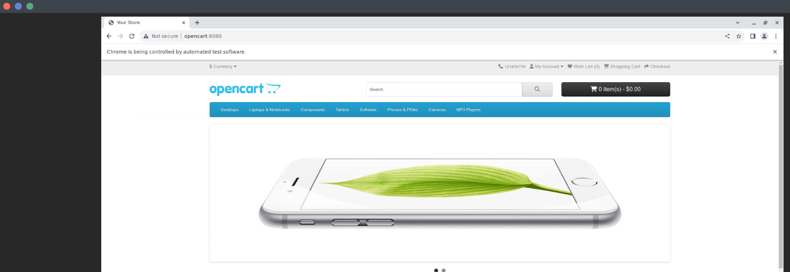

## Написать docker-compose.yml файл для своего проекта

### Цель:

Научиться разворачивать тестовую среду и запускать в ней тесты

### Описание:

1. Написать `docker-compose.yml`, с помощью которого можно развернуть opencart
2. Добавить в `docker-compose.yml` секцию для запуска контейнера с тестами

### Критерии оценки:

Статус "Принято" ставится, если:

1. В репозитории есть файл `docker-compose.yml`, с помощью которого можно развернуть opencart
2. В `docker-compose.yml` должна быть секция `tests`, с помощью которой можно запустить ваши тесты
3. Тесты должны дожидаться запуска opencart, запускаться на selenoid и успешно проходить

### Рекомендации:

Первое, что нужно сделать это убедиться, что у вас локально развёрнут selenoid.
Должны быть запущены контейнеры `selenoid` и `selenoid-ui` в отдельной сети с именем `selenoid`.

**Важно!** Для контейнера `selenoid-ui` лучше использовать порт хоста отличный от 8080.
Это нужно чтобы не возникло конфликта с запущенным приложением opencart, которое по умолчанию использует порт 8080.
Чтобы поменять порт по-умолчанию для контейнера `selenoid-ui` нужно запустить контейнер следующей командой:

```shell
docker run -d --name selenoid-ui --network selenoid -p 8090:8080 aerokube/selenoid-ui:1.10.11 --selenoid-uri http://selenoid:4444
```

Далее необходимо запустить opencart. За основу можно взять файл из репозитория лекции - 
[docker-compose.yml](https://github.com/agridyaev/otus-docker-compose/blob/master/docker-compose-opencart.yml)

Запускаем opencart с помощью следующей команды и дожидаемся окончания его запуска:

```shell
docker-compose -f docker-compose-opencart.yml up
```

Необходимо убедиться, что вы можете зайти на ваш opencart из selenoid. 
Для этого в selenoid нужно запустить мануальную сессию любого браузера и попробовать запросить адрес http://opencart:8080/

Сайт opencart должен выглядеть как показано на скриншоте:



Теперь можно попробовать вручную запустить ваши тесты в поднятом тестовом окружении.
У вас уже должен быть собран образ с вашими тестами, в этом примере имя образа - `opencart-tests`.
Пробуем запустить тесты на selenoid - для этого выполняем следующую команду (опции могут отличаться в зависимости от того что вы указали в `conftest.py`):

```shell
docker run --rm --network selenoid opencart-tests pytest -v tests/test_ui_opencart.py --opencart_url http://opencart:8080 --browser chrome --browser_version 120.0 --executor selenoid
```

С помощью этой команды мы запускаем наши тесты в браузере chrome 120.0 версии удалённо на selenoid.
Тесты должны успешно запуститься и отработать на selenoid:

```shell
docker run --rm --network selenoid opencart-tests pytest -v tests/test_ui_opencart.py --opencart_url http://opencart:8080 --browser chrome --browser_version 120.0 --executor selenoid
============================= test session starts ==============================
platform linux -- Python 3.10.5, pytest-6.2.5, py-1.11.0, pluggy-1.3.0 -- /usr/local/bin/python
cachedir: .pytest_cache
rootdir: /app, configfile: pytest.ini
plugins: allure-pytest-2.9.45, forked-1.6.0, xdist-2.5.0
collecting ... collected 4 items

tests/test_ui_opencart.py::test_main_page_menu PASSED                    [ 25%]
tests/test_ui_opencart.py::test_main_page_fetured_items PASSED           [ 50%]
tests/test_ui_opencart.py::test_main_page_footer_blocks PASSED           [ 75%]
tests/test_ui_opencart.py::test_main_page_open_product PASSED            [100%]

============================== 4 passed in 5.44s ===============================
```

Теперь в `docker-compose.yml` нужно добавить сервис `tests`, который будет стартовать после поднятия тестового окружения,
т. е. после того как запустится opencart.

Так как opencart не стартует мгновенно, при запуске сервиса с тестами нужно организовать ожидание, пока opencart полностью
перейдёт в рабочее состояние.

Для этого можно использовать скрипт [wait-for-it.sh](wait-for-it.sh). Подробнее про этот скрипт можно почитать [тут](wait-for-it.md). 
Текст этого скрипта нужно сохранить в файл с названием `wait-for-it.sh`, сделать файл исполняемым (`chmod +x wait-for-it.sh`) и добавить в образ с тестами.

В `docker-compose.yml` в инструкции `command` сервиса `tests` скрипт [wait-for-it.sh](wait-for-it.sh) можно использовать так:
```shell
command: ./wait-for-it.sh opencart 8080 pytest -v tests/test_ui_opencart.py --opencart_url http://opencart:8080 --browser chrome --browser_version 120.0 --executor selenoid
```

**Важно!** Для того, чтобы сработала команда, указанная в директиве `command` файла `docker-compose.yml` нужно чтобы в `Dockerfile` образа с тестами для запуска тестов использовалась директива `CMD`.

Таким образом при запуске `docker-compose` контейнер с тестами дождётся пока запустится opencart и затем запустит тесты.

В итоге у вас должен получиться `docker-compose.yml` с помощью которого можно развернуть тестовое окружение и запустить тесты.
