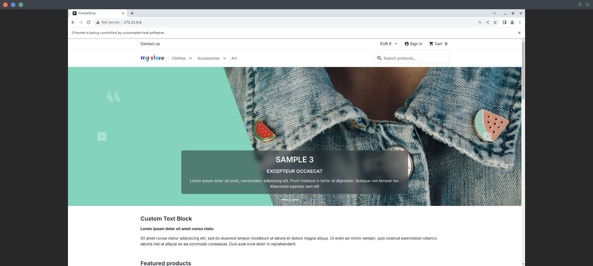

## Написать docker-compose.yml файл для своего проекта

### Цель:

Научиться разворачивать тестовую среду и запускать в ней тесты

### Описание:

1. Написать `docker-compose.yml`, с помощью которого можно развернуть PrestaShop
2. Добавить в `docker-compose.yml` секцию для запуска контейнера с тестами

### Критерии оценки:

Статус "Принято" ставится, если:

1. В репозитории есть файл `docker-compose.yml`, с помощью которого можно развернуть PrestaShop
2. В `docker-compose.yml` должна быть секция `tests`, с помощью которой можно запустить ваши тесты
3. Тесты должны дожидаться запуска PrestaShop, запускаться на selenoid и успешно проходить

### Рекомендации:

Первое, что нужно сделать это убедиться, что у вас локально развёрнут selenoid.
Должны быть запущены контейнеры `selenoid` и `selenoid-ui` в отдельной сети с именем `selenoid`.
При необходимости можно поменять порт по-умолчанию для контейнера `selenoid-ui` нужно запустить контейнер следующей командой:

```shell
docker run -d --name selenoid-ui --network selenoid -p 8090:8080 aerokube/selenoid-ui:1.10.11 --selenoid-uri http://selenoid:4444
```

Далее необходимо запустить PrestaShop. За основу можно взять файл - 
[docker-compose.yml](../prestashop/docker-compose.yml)

**Важно!** В файл [docker-compose.yml](https://gist.github.com/konflic/ecd93a4bf7666d97d62bcecbe2713e55#file-docker-compose-yml)
нужно обязательно внести следующие изменения в секцию `networks`:

```yaml
networks:
  prestashop_network:
    external:
      name: selenoid
```

Таким образом, контейнеры PrestaShop и selenoid будут находиться в одной сети, что обеспечит их связность и позволит им взаимодействовать между собой.

Запускаем PrestaShop с помощью следующей команды и дожидаемся окончания его запуска:

```shell
docker-compose -f docker-compose.yml up
```

Необходимо убедиться, что вы можете зайти на ваш PrestaShop из selenoid. 
Для этого в selenoid нужно запустить мануальную сессию любого браузера и попробовать запросить адрес http://prestashop

Сайт PrestaShop должен выглядеть как показано на скриншоте:



Теперь можно попробовать вручную запустить ваши тесты в поднятом тестовом окружении.
У вас уже должен быть собран образ с вашими тестами, в этом примере имя образа - `prestashop-tests`.
Пробуем запустить тесты на selenoid - для этого выполняем следующую команду (опции могут отличаться в зависимости от того что вы указали в `conftest.py`):

```shell
docker run --rm --network selenoid prestashop-tests pytest -v tests/test_ui_prestashop.py --prestashop_url http://prestashop --browser chrome --browser_version 120.0 --executor selenoid
```

С помощью этой команды мы запускаем наши тесты в браузере chrome 120.0 версии удалённо на selenoid.
Тесты должны успешно запуститься и отработать на selenoid:

```shell
docker run --rm --network selenoid prestashop-tests pytest -v tests/test_ui_prestashop.py --prestashop_url http://prestashop --browser chrome --browser_version 120.0 --executor selenoid
============================= test session starts ==============================
platform linux -- Python 3.10.5, pytest-6.2.5, py-1.11.0, pluggy-1.3.0 -- /usr/local/bin/python
cachedir: .pytest_cache
rootdir: /app, configfile: pytest.ini
plugins: allure-pytest-2.9.45, forked-1.6.0, xdist-2.5.0
collecting ... collected 4 items

tests/test_ui_prestashop.py::test_main_page_menu PASSED                    [ 25%]
tests/test_ui_prestashop.py::test_main_page_fetured_items PASSED           [ 50%]
tests/test_ui_prestashop.py::test_main_page_footer_blocks PASSED           [ 75%]
tests/test_ui_prestashop.py::test_main_page_open_product PASSED            [100%]

============================== 4 passed in 5.44s ===============================
```

Теперь в `docker-compose.yml` нужно добавить сервис `tests`, который будет стартовать после поднятия тестового окружения,
т. е. после того как запустится prestashop.

Так как prestashop не стартует мгновенно, при запуске сервиса с тестами нужно организовать ожидание, пока prestashop полностью
перейдёт в рабочее состояние.

Для этого в описании сервиса `tests` можно использовать директиву `condition: service_healthy` в `depends_on`:
```yaml
depends_on:
  prestashop:
    condition: service_healthy
```
Данная директива позволяет гарантировать, что контейнер с тестами дождётся пока запустится prestashop и затем запустит тесты.

**Важно!** Для того, чтобы сработала директива `condition: service_healthy` необходимо убедиться в наличии секции `healthcheck`
в описании сервиса `prestashop`:
```yaml
healthcheck:
  test: [ "CMD", "curl", "-f", "http://prestashop" ]
  interval: 10s
  timeout: 5s
  retries: 3
```

В итоге у вас должен получиться `docker-compose.yml` с помощью которого можно развернуть тестовое окружение и запустить тесты.
