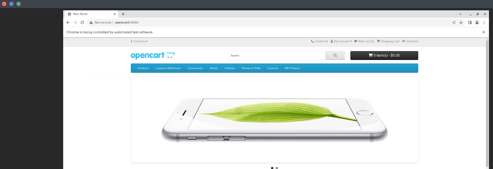

## Написать Dockerfile для своего проекта

### Цель:

Научиться заворачивать свои проекты в Docker

### Описание:

1. Написать Dockerfile, с помощью которого можно запустить ваши тесты на opencart
2. Запуск должен сохранить возможность передачи параметров при запуске контейнера с тестами

### Критерии оценки:

Статус "Принято" ставится, если в проекте есть работающий `Dockerfile`

### Рекомендации:

После того как вы создадите ваш `Dockerfile` попробуйте собрать образ с помощью этого файла:

```shell
docker build -t tests .
```

После сборки попробуйте запустить тесты с помощью собранного образа. 

Первое, что нужно сделать это убедиться, что у вас локально развёрнут selenoid.
Должны быть запущены контейнеры `selenoid` и `selenoid-ui` в отдельной сети с именем `selenoid`.

**Важно!** Для контейнера `selenoid-ui` лучше использовать порт хоста отличный от 8080.
Это нужно чтобы не было конфликта с запущенным приложением opencart, которое по умолчанию использует порт 8080.
Чтобы поменять порт по-умолчанию для контейнера `selenoid-ui` нужно запустить контейнер следующей командой:

```shell
docker run -d --name selenoid-ui --network selenoid -p 8090:8080 aerokube/selenoid-ui:1.10.11 --selenoid-uri http://selenoid:4444
```

Далее необходимо запустить opencart. За основу можно взять файл - 
[docker-compose.yml](https://github.com/agridyaev/otus-docker-compose/blob/master/docker-compose-opencart.yml)

Запускаем opencart с помощью следующей команды (более подробно `docker-compose` мы рассмотрим в следующей лекции) 
и дожидаемся окончания его запуска:

```shell
docker-compose -f docker-compose-opencart.yml up
```

Необходимо убедиться, что вы можете зайти на ваш opencart из selenoid. 
Для этого в selenoid нужно запустить мануальную сессию любого браузера и попробовать запросить адрес http://opencart:8080/

Сайт opencart должен выглядеть как показано на скриншоте:



Теперь можно попробовать вручную запустить ваши тесты в поднятом тестовом окружении.
У вас уже должен быть собран образ `tests` с вашими тестами.
Пробуем запустить тесты на selenoid - для этого выполняем следующую команду (опции могут отличаться в зависимости от того,
что вы указали в `conftest.py` и в `Dockerfile` для успешного запуска команды подразумевается использование директивы `ENTRYPOINT ["pytest"]`):

```shell
docker run -it --rm --network selenoid tests -v tests/test_ui_opencart.py --opencart_url http://opencart:8080 --browser chrome --browser_version 120.0 --executor selenoid
```

С помощью этой команды мы запускаем наши тесты в браузере chrome 120.0 версии удалённо на selenoid.
Тесты должны успешно запуститься и отработать на selenoid:

```shell
docker run -it --rm --network selenoid tests -v tests/test_ui_opencart.py --opencart_url http://opencart:8080 --browser chrome --browser_version 120.0 --executor selenoid
============================= test session starts ==============================
platform linux -- Python 3.10.5, pytest-6.2.5, py-1.11.0, pluggy-1.3.0 -- /usr/local/bin/python
cachedir: .pytest_cache
rootdir: /app, configfile: pytest.ini
plugins: allure-pytest-2.9.45, forked-1.6.0, xdist-2.5.0
collecting ... collected 4 items

tests/test_ui_opencart.py::test_main_page_menu PASSED                    [ 25%]
tests/test_ui_opencart.py::test_main_page_fetured_items PASSED           [ 50%]
tests/test_ui_opencart.py::test_main_page_footer_blocks PASSED           [ 75%]
tests/test_ui_opencart.py::test_main_page_open_product PASSED            [100%]

============================== 4 passed in 5.44s ===============================
```

Убедитесь, что запуск тестов осуществляется корректно при использовании опций из файла `conftest.py`. 
Например, в `conftest.py` указана опция `--browser` для выбора браузера, в котором будут выполняться тесты:

```python
def pytest_addoption(parser):
    parser.addoption("--browser", action="store", default="chrome")
```

Запускаем тесты с использованием этой опции:

```shell
docker run -it --rm --network selenoid tests -v tests/test_ui_opencart.py --opencart_url http://opencart:8080 --browser firefox --browser_version 120.0 --executor selenoid
```

В этом случае тесты должны запуститься в браузере Firefox